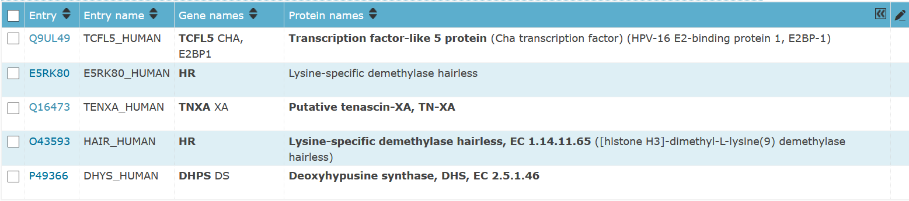

```{r setup, include=FALSE}
knitr::opts_chunk$set(echo = TRUE)
```

# Load libraries

```{r}
suppressMessages(library(tidyverse))
suppressMessages(library(ggplot2))
```

## Load Data

```{r}
# Human reference proteome - Mar 29 2021 with PMC full text
human_full <- read_csv("https://raw.githubusercontent.com/asjew/heart_caseolap_EDA/main/Data/Human%20reference%20proteome%20-%20Mar%2029%202021/results/caseolap.csv")
head(human_full)
summary(human_full)
```

# Exploratory Data Analysis

```{r}
# Finding proteins that are strictly exclusive to VOO (all groups are 0 except VOO)
# None in this dataset
which(human_full$IHD == 0 & human_full$CM == 0 & human_full$ARR == 0 &
        human_full$VD == 0 & human_full$CHD == 0 & human_full$CCD == 0 & human_full$OTH == 0) 

# Get index of proteins that have caseolap score < 0.01 in all groups except VOO and where VOO > 0.01
VOO_01 <- which(human_full$IHD < 0.01 & human_full$CM < 0.01 & human_full$ARR < 0.01 &
                  human_full$VD < 0.01 & human_full$CHD < 0.01 & human_full$CCD < 0.01 &
                  human_full$OTH < 0.01 & human_full$VOO > 0.01)

human_full[VOO_01, ] # Displaying the proteins and caseolap scores with indices VOO_01
```

```{r}
# Proteins that have VOO caseolap score > 0.05
human_full[which(human_full$VOO > 0.05), ]

# Proteins where VOO has highest caseolap score and also has a caseolap score > 0.05
human_full[which(human_full$IHD < human_full$VOO & human_full$CM < human_full$VOO &
                   human_full$ARR < human_full$VOO & human_full$VD < human_full$VOO &
                   human_full$CHD < human_full$VOO & human_full$CCD < human_full$VOO &
                   human_full$OTH < human_full$VOO & human_full$VOO > 0.05), ]
```

# EDA with Z-scores

```{r}
# Convert caseolap scores into z-scores by column/group
human_standard <- data.frame("protein" = human_full$protein, apply(human_full[2:9], 2, scale))
summary(human_standard)
```

```{r}
human_standard[which(human_standard$VOO > 10), ]$protein # proteins with VOO z-score > 10

human_standard[which(human_standard$IHD < human_standard$VOO &
                       human_standard$CM < human_standard$VOO &
                       human_standard$ARR < human_standard$VOO &
                       human_standard$VD < human_standard$VOO &
                       human_standard$CHD < human_standard$VOO &
                       human_standard$CCD < human_standard$VOO &
                       human_standard$OTH < human_standard$VOO &
                       human_standard$VOO > 10), ]$protein 
# proteins where VOO has highest z-score and VOO > 10 (same as proteins above)
```

```{r}
# Histogram of Z-score for each group

ggplot(human_standard, aes(x = IHD)) + geom_histogram(fill = "lightblue", bins = 50) + ggtitle("Distribution of CaseOLAP Scores for IHD Disease Group (Human)")
ggplot(human_standard, aes(x = CM)) + geom_histogram(fill = "lightblue", bins = 50)
ggplot(human_standard, aes(x = ARR)) + geom_histogram(fill = "lightblue", bins = 50)
ggplot(human_standard, aes(x = VD)) + geom_histogram(fill = "lightblue", bins = 50)
ggplot(human_standard, aes(x = CHD)) + geom_histogram(fill = "lightblue", bins = 50)
ggplot(human_standard, aes(x = CCD)) + geom_histogram(fill = "lightblue", bins = 50)
ggplot(human_standard, aes(x = VOO)) + geom_histogram(fill = "lightblue", bins = 50)
ggplot(human_standard, aes(x = OTH)) + geom_histogram(fill = "lightblue", bins = 50)
```

```{r}
# Ranges of Z-score scores by group
human_standard_min <- sapply(human_standard[2:9], min)
human_standard_max <- sapply(human_standard[2:9], max)
human_standard_ranges <- data.frame(id=c("IHD", "CM", "ARR","VD", "CHD", "CCD", "VOO", "OTH"),
                                    min=human_standard_min, max=human_standard_max)

ggplot(human_standard_ranges, aes(x=id))+
  geom_linerange(aes(ymin=min,ymax=max),linetype=2,color="blue")+
  geom_point(aes(y=min),size=3,color="red")+
  geom_point(aes(y=max),size=3,color="red")+
  theme_bw() + ggtitle("Ranges of Z-score Scores by Disease Group (Human)") + xlab("Disease Group") + ylab("Z-score Score")
```

# Finding top unique proteins for each group

Cut-off z-scores are roughly chosen and can be changed to get a smaller or larger list of proteins

## IHD

```{r}
human_standard[which(human_standard$VOO < human_standard$IHD &
                       human_standard$CM < human_standard$IHD &
                       human_standard$ARR < human_standard$IHD &
                       human_standard$VD < human_standard$IHD &
                       human_standard$CHD < human_standard$IHD &
                       human_standard$CCD < human_standard$IHD &
                       human_standard$OTH < human_standard$IHD &
                       human_standard$IHD > 9), ] 
# proteins where IHD has highest z-score and is above 9
```


## CM
```{r}
human_standard[which(human_standard$IHD < human_standard$CM &
                       human_standard$VOO < human_standard$CM &
                       human_standard$ARR < human_standard$CM &
                       human_standard$VD < human_standard$CM &
                       human_standard$CHD < human_standard$CM &
                       human_standard$CCD < human_standard$CM &
                       human_standard$OTH < human_standard$CM &
                       human_standard$CM > 8), ] 
# proteins where CM has highest z-score and above 8
```


## ARR
```{r}
human_standard[which(human_standard$IHD < human_standard$ARR &
                       human_standard$CM < human_standard$ARR &
                       human_standard$VOO < human_standard$ARR &
                       human_standard$VD < human_standard$ARR &
                       human_standard$CHD < human_standard$ARR &
                       human_standard$CCD < human_standard$ARR &
                       human_standard$OTH < human_standard$ARR &
                       human_standard$ARR > 9), ]
# proteins where ARR has highest z-score and above 9
```



## VD
```{r}
human_standard[which(human_standard$IHD < human_standard$VD &
                       human_standard$CM < human_standard$VD &
                       human_standard$ARR < human_standard$VD &
                       human_standard$VOO < human_standard$VD &
                       human_standard$CHD < human_standard$VD &
                       human_standard$CCD < human_standard$VD &
                       human_standard$OTH < human_standard$VD &
                       human_standard$VD > 8), ]
# proteins where VD has highest z-score and above 8
```


## CHD
```{r}
human_standard[which(human_standard$IHD < human_standard$CHD &
                       human_standard$CM < human_standard$CHD &
                       human_standard$ARR < human_standard$CHD &
                       human_standard$VD < human_standard$CHD &
                       human_standard$VOO < human_standard$CHD &
                       human_standard$CCD < human_standard$CHD &
                       human_standard$OTH < human_standard$CHD &
                       human_standard$VD > 5), ] 
# proteins where CHD has highest z-score and above 5
```


## CCD
```{r}
human_standard[which(human_standard$IHD < human_standard$CCD &
                       human_standard$CM < human_standard$CCD &
                       human_standard$ARR < human_standard$CCD &
                       human_standard$VD < human_standard$CCD &
                       human_standard$CHD < human_standard$CCD &
                       human_standard$VOO < human_standard$CCD &
                       human_standard$OTH < human_standard$CCD &
                       human_standard$CCD > 10), ] 
# proteins where CCD has highest z-score and above 10
```


## VOO
```{r}
human_standard[which(human_standard$IHD < human_standard$VOO &
                       human_standard$CM < human_standard$VOO &
                       human_standard$ARR < human_standard$VOO &
                       human_standard$VD < human_standard$VOO &
                       human_standard$CHD < human_standard$VOO &
                       human_standard$CCD < human_standard$VOO &
                       human_standard$OTH < human_standard$VOO &
                       human_standard$VOO > 10), ]
```


## OTH
```{r}
human_standard[which(human_standard$IHD < human_standard$OTH &
                       human_standard$CM < human_standard$OTH &
                       human_standard$ARR < human_standard$OTH &
                       human_standard$VD < human_standard$OTH &
                       human_standard$CHD < human_standard$OTH &
                       human_standard$CCD < human_standard$OTH &
                       human_standard$VOO < human_standard$OTH &
                       human_standard$OTH > 7), ] 
# proteins where OTH has highest z-score and above 7
```

