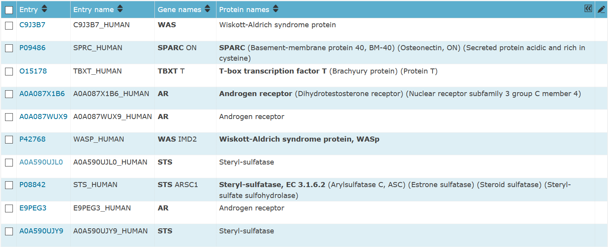

```{r setup, include=FALSE}
knitr::opts_chunk$set(echo = TRUE)
```

# Load libraries

```{r}
suppressMessages(library(tidyverse))
suppressMessages(library(ggplot2))
```

## Load Data

```{r}
# Human reference proteome - Mar 29 2021 with PMC full text
human_full <- read_csv("https://raw.githubusercontent.com/asjew/heart_caseolap_EDA/main/Data/Human%20reference%20proteome%20-%20Mar%2029%202021/results/caseolap.csv")
head(human_full)
summary(human_full)
```

# Exploratory Data Analysis

```{r}
# Finding proteins that are strictly exclusive to VOO (all groups are 0 except VOO)
# None in this dataset
which(human_full$IHD == 0 & human_full$CM == 0 & human_full$ARR == 0 &
        human_full$VD == 0 & human_full$CHD == 0 & human_full$CCD == 0 & human_full$OTH == 0) 

# Get index of proteins that have caseolap score < 0.01 in all groups except VOO and where VOO > 0.01
VOO_01 <- which(human_full$IHD < 0.01 & human_full$CM < 0.01 & human_full$ARR < 0.01 &
                  human_full$VD < 0.01 & human_full$CHD < 0.01 & human_full$CCD < 0.01 &
                  human_full$OTH < 0.01 & human_full$VOO > 0.01)

human_full[VOO_01, ] # Displaying the proteins and caseolap scores with indices VOO_01
```

```{r}
# Proteins that have VOO caseolap score > 0.05
human_full[which(human_full$VOO > 0.05), ]

# Proteins where VOO has highest caseolap score and also has a caseolap score > 0.05
human_full[which(human_full$IHD < human_full$VOO & human_full$CM < human_full$VOO &
                   human_full$ARR < human_full$VOO & human_full$VD < human_full$VOO &
                   human_full$CHD < human_full$VOO & human_full$CCD < human_full$VOO &
                   human_full$OTH < human_full$VOO & human_full$VOO > 0.05), ]
```

# EDA with Z-scores

```{r}
# Convert caseolap scores into z-scores by column/group
human_standard <- data.frame("protein" = human_full$protein, apply(human_full[2:9], 2, scale))
summary(human_standard)
```

```{r}
human_standard[which(human_standard$VOO > 10), ]$protein # proteins with VOO z-score > 10

human_standard[which(human_standard$IHD < human_standard$VOO &
                       human_standard$CM < human_standard$VOO &
                       human_standard$ARR < human_standard$VOO &
                       human_standard$VD < human_standard$VOO &
                       human_standard$CHD < human_standard$VOO &
                       human_standard$CCD < human_standard$VOO &
                       human_standard$OTH < human_standard$VOO &
                       human_standard$VOO > 10), ]$protein 
# proteins where VOO has highest z-score and VOO > 10 (same as proteins above)
```

```{r}
# Histogram of Z-score for each group

ggplot(human_standard, aes(x = IHD)) + geom_histogram(fill = "lightblue", bins = 50) + ggtitle("Distribution of CaseOLAP Scores for IHD Disease Group (Human)")
ggplot(human_standard, aes(x = CM)) + geom_histogram(fill = "lightblue", bins = 50)
ggplot(human_standard, aes(x = ARR)) + geom_histogram(fill = "lightblue", bins = 50)
ggplot(human_standard, aes(x = VD)) + geom_histogram(fill = "lightblue", bins = 50)
ggplot(human_standard, aes(x = CHD)) + geom_histogram(fill = "lightblue", bins = 50)
ggplot(human_standard, aes(x = CCD)) + geom_histogram(fill = "lightblue", bins = 50)
ggplot(human_standard, aes(x = VOO)) + geom_histogram(fill = "lightblue", bins = 50)
ggplot(human_standard, aes(x = OTH)) + geom_histogram(fill = "lightblue", bins = 50)
```

```{r}
# Ranges of Z-score scores by group
human_standard_min <- sapply(human_standard[2:9], min)
human_standard_max <- sapply(human_standard[2:9], max)
human_standard_ranges <- data.frame(id=c("IHD", "CM", "ARR","VD", "CHD", "CCD", "VOO", "OTH"),
                                    min=human_standard_min, max=human_standard_max)

ggplot(human_standard_ranges, aes(x=id))+
  geom_linerange(aes(ymin=min,ymax=max),linetype=2,color="blue")+
  geom_point(aes(y=min),size=3,color="red")+
  geom_point(aes(y=max),size=3,color="red")+
  theme_bw() + ggtitle("Ranges of Z-score Scores by Disease Group (Human)") + xlab("Disease Group") + ylab("Z-score Score")
```

# Finding top unique proteins for each group

Cut-off z-scores are roughly chosen and can be changed to get a smaller or larger list of proteins

## IHD

```{r}
human_standard[which(human_standard$VOO < human_standard$IHD &
                       human_standard$CM < human_standard$IHD &
                       human_standard$ARR < human_standard$IHD &
                       human_standard$VD < human_standard$IHD &
                       human_standard$CHD < human_standard$IHD &
                       human_standard$CCD < human_standard$IHD &
                       human_standard$OTH < human_standard$IHD &
                       human_standard$IHD > 9), ] 
# proteins where IHD has highest z-score and is above 9
```


## CM
```{r}
human_standard[which(human_standard$IHD < human_standard$CM &
                       human_standard$VOO < human_standard$CM &
                       human_standard$ARR < human_standard$CM &
                       human_standard$VD < human_standard$CM &
                       human_standard$CHD < human_standard$CM &
                       human_standard$CCD < human_standard$CM &
                       human_standard$OTH < human_standard$CM &
                       human_standard$CM > 8), ] 
# proteins where CM has highest z-score and above 8
```


## ARR
```{r}
human_standard[which(human_standard$IHD < human_standard$ARR &
                       human_standard$CM < human_standard$ARR &
                       human_standard$VOO < human_standard$ARR &
                       human_standard$VD < human_standard$ARR &
                       human_standard$CHD < human_standard$ARR &
                       human_standard$CCD < human_standard$ARR &
                       human_standard$OTH < human_standard$ARR &
                       human_standard$ARR > 9), ]
# proteins where ARR has highest z-score and above 9
```


## VD
```{r}
human_standard[which(human_standard$IHD < human_standard$VD &
                       human_standard$CM < human_standard$VD &
                       human_standard$ARR < human_standard$VD &
                       human_standard$VOO < human_standard$VD &
                       human_standard$CHD < human_standard$VD &
                       human_standard$CCD < human_standard$VD &
                       human_standard$OTH < human_standard$VD &
                       human_standard$VD > 8), ]
# proteins where VD has highest z-score and above 8
```


## CHD
```{r}
human_standard[which(human_standard$IHD < human_standard$CHD &
                       human_standard$CM < human_standard$CHD &
                       human_standard$ARR < human_standard$CHD &
                       human_standard$VD < human_standard$CHD &
                       human_standard$VOO < human_standard$CHD &
                       human_standard$CCD < human_standard$CHD &
                       human_standard$OTH < human_standard$CHD &
                       human_standard$VD > 5), ] 
# proteins where CHD has highest z-score and above 5
```


## CCD
```{r}
human_standard[which(human_standard$IHD < human_standard$CCD &
                       human_standard$CM < human_standard$CCD &
                       human_standard$ARR < human_standard$CCD &
                       human_standard$VD < human_standard$CCD &
                       human_standard$CHD < human_standard$CCD &
                       human_standard$VOO < human_standard$CCD &
                       human_standard$OTH < human_standard$CCD &
                       human_standard$CCD > 10), ] 
# proteins where CCD has highest z-score and above 10
```


## VOO
```{r}
human_standard[which(human_standard$IHD < human_standard$VOO &
                       human_standard$CM < human_standard$VOO &
                       human_standard$ARR < human_standard$VOO &
                       human_standard$VD < human_standard$VOO &
                       human_standard$CHD < human_standard$VOO &
                       human_standard$CCD < human_standard$VOO &
                       human_standard$OTH < human_standard$VOO &
                       human_standard$VOO > 10), ]
```



## OTH
```{r}
human_standard[which(human_standard$IHD < human_standard$OTH &
                       human_standard$CM < human_standard$OTH &
                       human_standard$ARR < human_standard$OTH &
                       human_standard$VD < human_standard$OTH &
                       human_standard$CHD < human_standard$OTH &
                       human_standard$CCD < human_standard$OTH &
                       human_standard$VOO < human_standard$OTH &
                       human_standard$OTH > 7), ] 
# proteins where OTH has highest z-score and above 7
```


# UpSet Plots

```{r}
library(UpSetR)

# http://gehlenborglab.org/research/projects/upsetr/

# Create dataframe with 8 columns corresponding to the 8 CVD groups
# 1 if protein is above threshold, 0 if not

# Threshold 0
human_binary <- ifelse(human_full[ , 2:9] > 0, 1, 0)
human_binary <- data.frame("protein" = human_full$protein, human_binary)

# Threshold 0.01
human_binary_01 <- ifelse(human_full[ , 2:9] > 0.01, 1, 0)
human_binary_01 <- data.frame("protein" = human_full$protein, human_binary_01)

# Threshold 0.02
human_binary_02 <- ifelse(human_full[ , 2:9] > 0.02, 1, 0)
human_binary_02 <- data.frame("protein" = human_full$protein, human_binary_02)

# Threshold 0.03
human_binary_03 <- ifelse(human_full[ , 2:9] > 0.03, 1, 0)
human_binary_03 <- data.frame("protein" = human_full$protein, human_binary_03)

# Threshold 0.05
human_binary_05 <- ifelse(human_full[ , 2:9] > 0.05, 1, 0)
human_binary_05 <- data.frame("protein" = human_full$protein, human_binary_05)
```

## UpSet Plot with 50 Intersections

```{r}
upset(human_binary,
      sets = c("IHD", "CM", "ARR", "VD", "CHD", "CCD", "VOO", "OTH"),
      sets.bar.color = "#56B4E9",
      number.angles = 5, 
      # c(intersection size title, intersection size tick labels, set size title, set size tick labels, set names, numbers above bars)
      text.scale = c(1, 1, 1, 1, 1, 1.1),
      set_size.show = TRUE,
      empty.intersections = "on",
      nintersects = 50)
```

## Single Disease Groups (No intersections)

```{r}
upset(human_binary,
      sets = c("IHD", "CM", "ARR", "VD", "CHD", "CCD", "VOO", "OTH"),
      sets.bar.color = "#56B4E9",
      number.angles = 5, 
      # c(intersection size title, intersection size tick labels, set size title, set size tick labels, set names, numbers above bars)
      text.scale = c(1, 1, 1, 1, 1, 1.1),
      set_size.show = TRUE,
      empty.intersections = "on",
      nintersects = 8)
```

## Threshold of 0 UpSet Plot

```{r}
upset(human_binary,
      sets = c("IHD", "CM", "ARR", "VD", "CHD", "CCD", "VOO", "OTH"),
      sets.bar.color = "#56B4E9",
      number.angles = 5, 
      # c(intersection size title, intersection size tick labels, set size title, set size tick labels, set names, numbers above bars)
      text.scale = c(1.3, 1.2, 1.1, 1.1, 1.25, 1.1),
      order.by = "freq",
      show.numbers = FALSE,
      mb.ratio = c(0.72, 0.28),
      empty.intersections = "on",
      mainbar.y.label = "Number of Proteins Appearing \n in Disease Group Intersection",
      sets.x.label = "Disease Group Set Size")
```

## Threshold of 0.01 UpSet Plot

```{r}
upset(human_binary_01,
      sets = c("IHD", "CM", "ARR", "VD", "CHD", "CCD", "VOO", "OTH"),
      sets.bar.color = "#56B4E9",
      number.angles = 5, 
      # c(intersection size title, intersection size tick labels, set size title, set size tick labels, set names, numbers above bars)
      text.scale = c(1.3, 1.2, 1.1, 1.1, 1.25, 1.1),
      order.by = "freq",
      show.numbers = FALSE,
      mb.ratio = c(0.72, 0.28),
      empty.intersections = "on",
      mainbar.y.label = "Number of Proteins Appearing \n in Disease Group Intersection",
      sets.x.label = "Disease Group Set Size")
```

## Threshold of 0.02 UpSet Plot

```{r}
upset(human_binary_02,
      sets = c("IHD", "CM", "ARR", "VD", "CHD", "CCD", "VOO", "OTH"),
      sets.bar.color = "#56B4E9",
      number.angles = 5, 
      # c(intersection size title, intersection size tick labels, set size title, set size tick labels, set names, numbers above bars)
      text.scale = c(1.3, 1.2, 1.1, 1.1, 1.25, 1.1),
      order.by = "freq",
      show.numbers = FALSE,
      mb.ratio = c(0.72, 0.28),
      empty.intersections = "on",
      mainbar.y.label = "Number of Proteins Appearing \n in Disease Group Intersection",
      sets.x.label = "Disease Group Set Size")
```

## Threshold of 0.03 UpSet Plot

```{r}
upset(human_binary_03,
      sets = c("IHD", "CM", "ARR", "VD", "CHD", "CCD", "VOO", "OTH"),
      sets.bar.color = "#56B4E9",
      number.angles = 5, 
      # c(intersection size title, intersection size tick labels, set size title, set size tick labels, set names, numbers above bars)
      text.scale = c(1.3, 1.2, 1.1, 1.1, 1.25, 1.1),
      order.by = "freq",
      show.numbers = FALSE,
      mb.ratio = c(0.72, 0.28),
      empty.intersections = "on",
      mainbar.y.label = "Number of Proteins Appearing \n in Disease Group Intersection",
      sets.x.label = "Disease Group Set Size")
```

## Threshold of 0.05 UpSet Plot

```{r}
upset(human_binary_05,
      sets = c("IHD", "CM", "ARR", "VD", "CHD", "CCD", "VOO", "OTH"),
      sets.bar.color = "#56B4E9",
      number.angles = 5, 
      # c(intersection size title, intersection size tick labels, set size title, set size tick labels, set names, numbers above bars)
      text.scale = c(1.3, 1.2, 1.1, 1.1, 1.25, 1.1),
      order.by = "freq",
      show.numbers = FALSE,
      mb.ratio = c(0.72, 0.28),
      empty.intersections = "on",
      mainbar.y.label = "Number of Proteins Appearing \n in Disease Group Intersection",
      sets.x.label = "Disease Group Set Size")
```

```{r}
# library(devtools)
# install_github("jokergoo/ComplexHeatmap")
# Refer to https://jokergoo.github.io/ComplexHeatmap-reference/book/upset-plot.html#example-with-the-movies-dataset

# For Threshold 0 dataframe
# Make binary matrix
human_binary_mat <- ComplexHeatmap::make_comb_mat(human_binary)
# Get size for each intersection
human_binary_comb_size <- sort(ComplexHeatmap::comb_size(human_binary_mat), decreasing = TRUE)
# Get size for each category set
human_binary_set_size <- ComplexHeatmap::set_size(human_binary_mat)

# For Threshold 0.03 dataframe
# Make binary matrix
human_binary_mat_03 <- ComplexHeatmap::make_comb_mat(human_binary_03)
# Get size for each intersection
human_binary_comb_size_03 <- sort(ComplexHeatmap::comb_size(human_binary_mat_03), decreasing = TRUE)
# Get size for each category set
human_binary_set_size_03 <- ComplexHeatmap::set_size(human_binary_mat_03)

# Get intersections with intersection size > 200 in the Threshold 0 dataframe
human_binary_names_subset <- names(human_binary_comb_size[human_binary_comb_size > 200])
# Find the size of those intersections in the Threshold 0.03 dataframe
human_binary_comb_size_03[human_binary_names_subset]
```

## Stacked Barplot comparing threshold 0 and threshold 0.03

```{r}
human_binary_subset <- data.frame(human_binary_names_subset,
                                  "count" = human_binary_comb_size[human_binary_names_subset],
                                  "threshold" = rep(0, 45))
human_binary_subset_03 <- data.frame(human_binary_names_subset,
                                     "count" = human_binary_comb_size_03[human_binary_names_subset],
                                     "threshold" = rep(0.03, 45))
human_binary_subset_double <- rbind(human_binary_subset, human_binary_subset_03)

ggplot(human_binary_subset_double, aes(fill=factor(threshold),
                                       y=count, x=reorder(human_binary_names_subset, -count))) + 
    geom_bar(position="stack", stat="identity") + theme(axis.text.x = element_text(angle = 90))
```

```{r}
# Exploring the ComplexHeatmap UpSet() function
human_binary_mat_subset <- human_binary_mat[ComplexHeatmap::comb_size(human_binary_mat) >= 100]

ComplexHeatmap::UpSet(human_binary_mat_subset,
                      set_order = order(ComplexHeatmap::set_size(human_binary_mat_subset),
                                        decreasing = TRUE),
                      comb_order = order(ComplexHeatmap::comb_size(human_binary_mat_subset),
                                         decreasing = TRUE),
                      pt_size = unit(2, "mm"))
```

## Stacked UpSet Plot comparing threshold 0 and threshold 0.03

```{r}
# Setting up dataframe
human_binary_TF <- human_binary
human_binary_TF[2:9] <- human_binary[2:9] == 1
human_binary_TF["Threshold"] <- '0'

human_binary_03_TF <- human_binary_03
human_binary_03_TF[2:9] <- human_binary_03[2:9] == 1
human_binary_03_TF["Threshold"] <- '0.03'

human_binary_double_TF <- rbind(human_binary_TF, human_binary_03_TF)
CVD_groups <- colnames(human_binary)[2:9]

# Upset plot
library(ComplexUpset)
upset(
  human_binary_double_TF,
  CVD_groups,
  base_annotations = list(
    'Number of Proteins Appearing \n in Disease Group Intersection' = intersection_size(
      counts = FALSE,
      mapping = aes(fill = Threshold)
    ) + scale_fill_manual(values=c(
            '0'='#E41A1C', '0.03'='#377EB8'))
  ),
  width_ratio = 0.15,
  n_intersections = 40,
  max_size = 12000,
  set_sizes=(
        upset_set_size(geom=geom_bar(
                aes(x=group),
                width=0.8),
                position = 'right')
        + theme(axis.text.x=element_text(angle=90))
        + ylab('Disease Group\n Set Size')),
   guides='over',
  name=''
)
```
